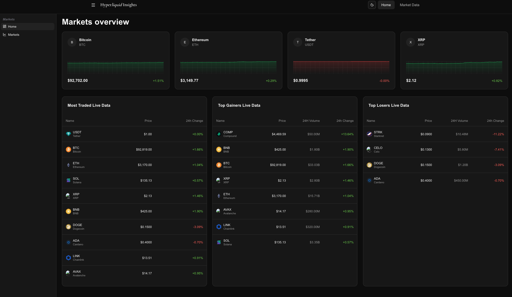
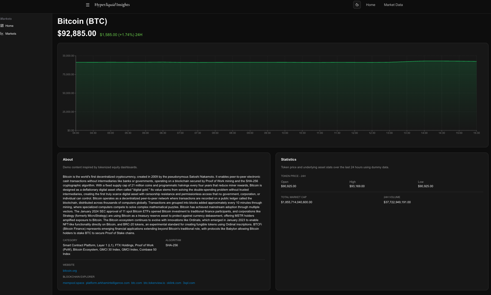
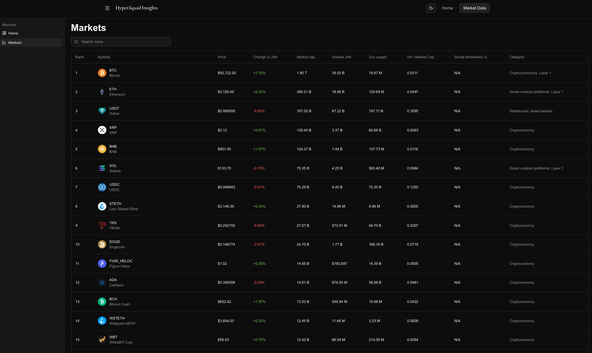

# Hyperliquid Insights

A modern cryptocurrency market dashboard for exploring real-time market data and insights. Built with Next.js 16, TypeScript, shadcn/ui, and powered by the CoinGecko API.

#### [Click here to see the Live Demo](https://hyperliquid-insights-web-szxm.vercel.app/)







## Project structure

See [🏗️ Architecture](docs/ARCHITECTURE.md)

## 🚀 Getting Started

### Prerequisites

- Node.js 20+
- npm or yarn

### Installation

```bash
# Install dependencies
npm install

# Run development server
npm run dev

# Build for production
npm run build
```

## 🛠️ Tech Stack

| Category      | Technologies                      |
| ------------- | --------------------------------- |
| **Framework** | Next.js, React                    |
| **Language**  | TypeScript                        |
| **Styling**   | Tailwind CSS, shadcn/ui, Radix UI |
| **State**     | TanStack Query                    |
| **Charts**    | Recharts                          |
| **Testing**   | Vitest, Testing Library           |
| **Tools**     | ESLint, Prettier                  |

## 📚 Documentation

- [🏗️ Architecture](docs/ARCHITECTURE.md) - System design, data flow, and migration guide
- [🔌 API Reference](docs/API_REFERENCE.md) - CoinGecko integration and API functions
- [🤖 AI Integration](docs/AI_INTEGRATION.md) - AI-readiness and extension points
- [🧪 Testing](docs/TESTING.md) - Test commands and coverage
- [🤝 Contributing](docs/CONTRIBUTING.md) - Development setup and workflow

## 🔄 Migration Story

This project was upgraded from **ChakraUI** to the modern stack of **Next.js 16** with **shadcn/ui** components, providing:

- Better performance with React Server Components
- More flexible styling with Tailwind CSS
- Improved accessibility with Radix UI primitives
- Type-safe component APIs
- Better developer experience with modern tooling

If you need client-side features like CoinGecko search, see [AI_INTEGRATION.md](docs/AI_INTEGRATION.md) for adding API routes.

## 📊 Features

- 📊 Market data visualization with real-time API integration
- 🎨 Modern UI with shadcn/ui components
- 🌙 Dark/light theme support
- 📱 Responsive design
- ♿ Accessible components (Radix UI)
- ⚡ Fast performance with Next.js 16
- 🔧 Type-safe with TypeScript
- 🔄 Automatic API fallback to mock data

## 🙏 Attribution

This project is an independent project inspired by
[thunderhead-labs/hyperliquid-stats-web](https://github.com/thunderhead-labs/hyperliquid-stats-web),
which is licensed under the MIT License.

This repository does not claim to be official or affiliated.
